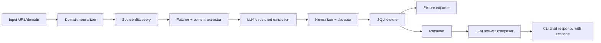

# Architecture

## Data Flow



## Components

### Domain Normalizer

Converts inputs like `https://robinhood.com/us/en/about-us/` into a canonical company key such as `robinhood.com`.

Responsibilities:

- Strip path/query.
- Preserve original input URL.
- Infer company display name when possible.
- Avoid assuming that `www.` and apex domains have different companies.

### Source Discovery

Finds candidate pages likely to contain leadership facts.

Priority order:

1. Official company domain pages.
2. Official investor relations pages.
3. Official blog author/profile pages.
4. Trusted company profile pages such as YC for startups.
5. Press releases and reputable business media when official data is incomplete.
6. LinkedIn only as fallback because scraping/access can be unreliable.

The source rank should be stored because the same person/title claim from an official page is stronger than a third-party mention.

### Fetcher

Fetches HTML, stores raw-ish text and metadata, and avoids repeated network work.

Stored metadata:

- URL.
- Final URL after redirects.
- Page title.
- Fetched timestamp.
- HTTP status.
- Content hash.
- Source rank.
- Extracted text.

### LLM Structured Extractor

Uses a real LLM with a strict schema. The model returns candidate people and claims, but the application validates them before storage.

Expected output per person:

```json
{
  "name": "Vlad Tenev",
  "title": "Chairman & Chief Executive Officer",
  "normalized_roles": ["CEO"],
  "department": "Executive",
  "location": "Bay Area of California",
  "profile_url": "https://investors.robinhood.com/management/vlad-tenev",
  "evidence": "short supporting snippet",
  "confidence": 0.95
}
```

### Normalizer

Maps titles into queryable categories:

- `CEO`, `CTO`, `CFO`, `CMO`, `CIO`, `CISO`, `CLO`, `COO`, etc.
- `VP`, `SVP`, `EVP`.
- `Head of X`, `Director of X`, `General Manager`.
- Departments/functions: Engineering, Product, Finance, Marketing, Legal, People, Security, Operations, Brokerage, Crypto.

The normalizer should preserve original title text. Normalization is additive, not destructive.

### Storage

SQLite is the best fit for this prototype because the domain is entity/claim oriented.

Planned tables:

- `companies`
- `sources`
- `people`
- `person_claims`
- `source_chunks`
- `chat_sessions`
- `chat_messages`

Key design choice: store claims separately from people. That lets us keep conflicting or stale public claims visible instead of hiding them.

### Retrieval

The retriever should choose structured queries before semantic search.

Examples:

- CTO question: query people whose normalized roles include `CTO`.
- VP count: count people with seniority `VP`, `SVP`, or `EVP`.
- Marketing head: query function `Marketing` and titles containing `Head`, `Chief`, `VP`, `SVP`, or `CMO`.
- CEO location: query person with normalized role `CEO`, then location claims.

Fallback: search source chunks by keyword and provide top snippets to the answer composer.

### Answer Composer

The final LLM call receives only retrieved rows and snippets. It must:

- Answer directly.
- Include citations.
- State uncertainty when facts are missing or conflicting.
- Avoid using outside knowledge not present in the dataset.

## Fixture Format

Each fixture should include:

```json
{
  "company": {
    "domain": "robinhood.com",
    "name": "Robinhood"
  },
  "sources": [],
  "people": [],
  "claims": [],
  "generated_at": "ISO-8601 timestamp",
  "generator_version": "git sha or package version"
}
```

## Failure Modes

- No leadership page found: return partial dataset with source-discovery diagnostics.
- Conflicting titles: keep both claims and surface the strongest source first.
- Missing CTO or VP data: answer "not found in collected public data" with source scope.
- Sites block crawling: use committed fixtures and document how live mode behaves.
- LLM returns invalid JSON: retry once, then store extraction error in run logs.

